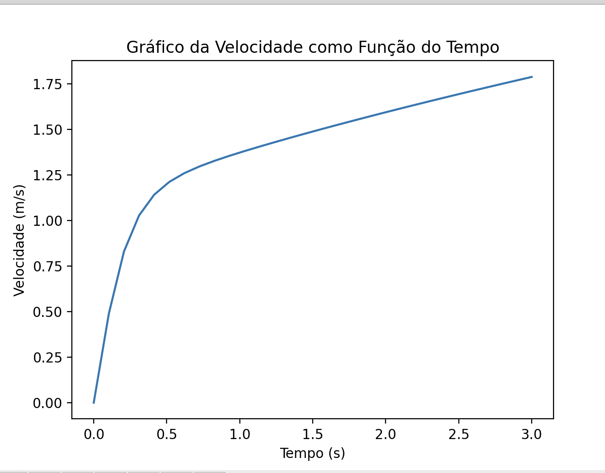

<h1 align="center">
    
</h1>

Efolio Global 2022 - Integração de Heun

📌 Integração de Heun

Um bloco de 2,0 kg de massa, inicialmente em repouso, é sujeito a uma força variável no tempo de magnitude 𝐹 = 10 + 5,0𝑡 (SI). Esta força atua até ao instante 3,0 s (exclusive) e depois cessa. O bloco sofre também uma força de arrasto do ar durante todo o seu movimento, proporcional ao quadrado da velocidade com coeficiente b = 8,0 kg/m.
a) Construa a equação de movimento para o bloco.
------------------
Para construir a equação de movimento do bloco, precisamos da segunda lei de Newton:

F = m * a

Onde 𝑎 é a aceleração do bloco, 𝑚 é a massa e 𝐹 é a força resultante atuando sobre ele. A força resultante inclui a força do motor e a força de arrasto do ar, que podem ser escritas como:

F = F_motor - b * v^2

Substituindo as equações acima na segunda lei de Newton, temos:

m * a = F_motor - b * v^2

Como a força do motor é variável no tempo, usaremos a equação 𝐹(𝑡) = 10 + 5,0𝑡 (SI). Assim, a equação de movimento fica:

m * a = 10 + 5 * t - b * v^2

Para resolver numericamente essa equação diferencial, usaremos o método de integração de Heun. Este método consiste em estimar a aceleração no próximo passo de tempo a partir da média ponderada das acelerações calculadas com as velocidades estimadas pelo método de Euler.

Para isso, precisamos da equação da velocidade:

v = v0 + a * t

e da equação da posição:

x = x0 + v * t

Também precisamos das condições iniciais:

v0 = 0 m/s (o bloco está inicialmente em repouso)
x0 = 0 m (o bloco está inicialmente na posição inicial)

b) Integre numericamente essa equação diferencial com passo h = 0,10 s até ao instante em que o bloco atinge 4,00 cm/s, e indique esse momento. Utilize uma tabela como a abaixo e, se possível, apresente um gráfico da velocidade como função do tempo.
 
Para compilar colocamos na mesma pasta o ficheiro heun.py e no terminal escrevemos: 
 
<strong>python3 efoliog2022.py</strong> 
 

🔧 Tecnologias utilizadas:
------------------

- <strong>Python 3.8.2</strong>
- <strong>Visual Studio Code</strong>
- <strong>MacOS</strong>

💬 Fale comigo
------------------
[*Entre em contato comigo*](https://www.linkedin.com/in/ivo-baptista-3712144/)

